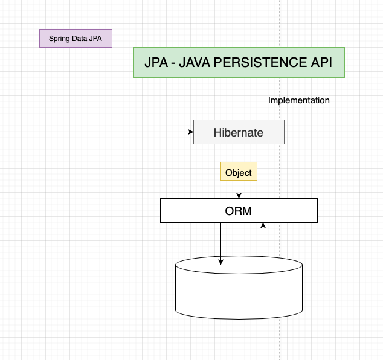
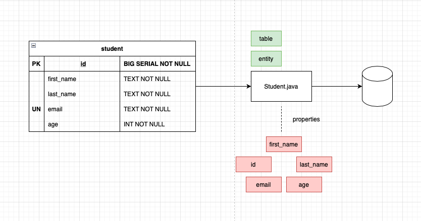

# playintWithJPA

## Project Overview

- Creating diagram to understand the whole picture of the project in my mind: http://draw.io.

- Choosing to create this project with Spring initializr to make it fast and simple as possible: https://start.spring.io.

Specifically:

WEB
- Spring Web (Build web, including ERSTful, applications using Spring MVC, Uses Apache Tomcat as the default embedded container).

SQL
- Spring Data JPA (Persist data in SQL with Java Persistence API using Spring Data and Hybernate).
- PostgreSQL Driver
  A JDBC and R2DBC driver that allows Java programs to connect to a PostgreSQL database using standard, database independent Java code.

## Setting project

### Creating simple API

- Connecting to database a setting the app properties

### Section overview

- Creating another diagram

### Creating student class

- Creating student class with properties

### @Entity

- Tell that class that we created, to be a table and also to attributes to be a column in our table

### @Sequence

- Create a sequence with our specified id

